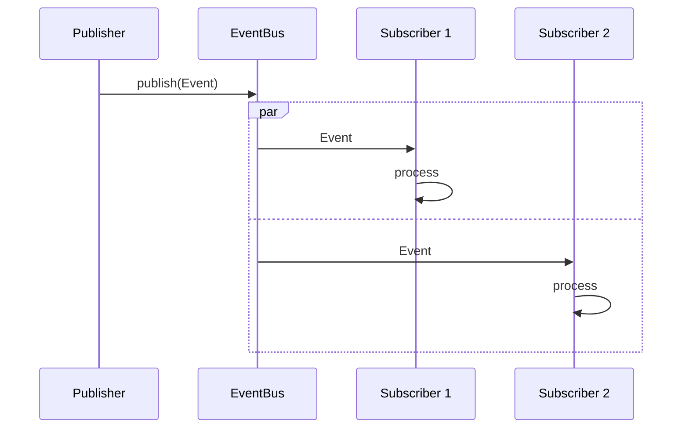
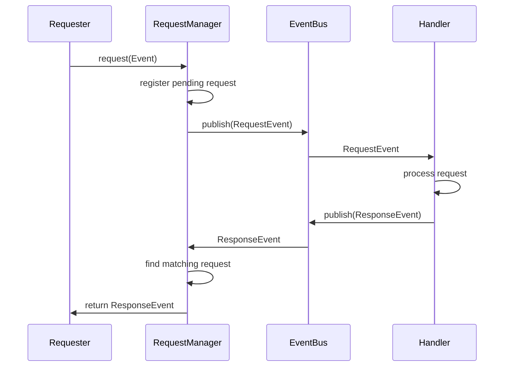

# KAIREI Event-Driven Architecture

> **Critical Architecture Document**
>
> This document describes a foundational architecture component of KAIREI.
> For implementation details, refer to the RustDoc documentation in:
> - `src/event/mod.rs`: Overview of the event system
> - `src/event/event_bus.rs`: EventBus implementation
> - `src/event/event_registry.rs`: Event type management
> - `src/event/request_manager.rs`: Request-response pattern

## Overview

KAIREI's event-driven architecture is the foundation of its agent communication system, enabling loosely coupled interactions between components through a centralized event bus and typed events.

## Design Philosophy

The event system was designed with the following principles:

1. **Decoupling**: Agents should be able to communicate without direct dependencies
2. **Type Safety**: Events should be strongly typed to catch errors at compile time
3. **Asynchronous Processing**: Non-blocking event processing for scalability
4. **Simplicity**: Simple yet powerful abstractions for common patterns

## Core Components

```
┌────────────────┐     ┌─────────────────┐     ┌─────────────────┐
│    EventBus    │◄────┤   EventRegistry  │     │    System       │
└───────┬────────┘     └─────────────────┘     └─────────┬───────┘
        │                                                 │
        │                      manages                    │
        ▼                                                 ▼
┌────────────────┐     ┌─────────────────┐     ┌─────────────────┐
│   Publisher    │────►│     Event       │◄────┤   Subscriber    │
└────────────────┘     └─────────────────┘     └─────────────────┘
```

### Event

The Event is the fundamental unit of communication in KAIREI:

```rust
pub struct Event {
    pub event_type: EventType,
    pub parameters: HashMap<String, Value>,
}
```

Events consist of:
- **EventType**: Identifies the kind of event (system, agent, request, response)
- **Parameters**: Key-value pairs containing the event payload

### EventBus

The EventBus is the central message hub that enables communication:

```rust
pub struct EventBus {
    event_sender: broadcast::Sender<Event>,
    error_sender: broadcast::Sender<ErrorEvent>,
    capacity: usize,
    // ...
}
```

The implementation uses Tokio's broadcast channel to efficiently deliver events to multiple subscribers simultaneously.

### EventRegistry

The EventRegistry manages event type definitions and validation:

```rust
pub struct EventRegistry {
    events: Arc<DashMap<EventType, EventInfo>>,
}
```

The registry:
- Stores metadata about event types
- Validates parameters against schemas
- Provides lookup services for event handling

### RequestManager

The RequestManager implements the request-response pattern on top of the asynchronous event bus:

```rust
pub struct RequestManager {
    event_bus: Arc<EventBus>,
    pending_requests: Arc<DashMap<RequestId, PendingRequest>>,
    default_timeout: Duration,
}
```

## Event Types

KAIREI defines several categories of events:

### System Events

System events manage the lifecycle and operation of the KAIREI runtime:

- **Tick**: Regular timing signals for time-based operations
- **MetricsSummary**: Periodic metrics collection
- **SystemLifecycle**: Events like SystemStarted, SystemStopped

### Agent Lifecycle Events

These events track the lifecycle of agents in the system:

- **AgentCreated**: When an agent is first created
- **AgentStarted**: When an agent becomes active
- **AgentStopped**: When an agent is deactivated

### Request/Response Events

Request/Response events implement synchronous patterns over the asynchronous bus:

- **Request**: A request from one agent to another
- **ResponseSuccess**: A successful response to a request
- **ResponseFailure**: A failed response to a request

### Custom Events

Custom events allow users to define domain-specific events:

- **Message**: General purpose content-based messages
- **Custom**: User-defined event types with custom parameters

## Event Flows

### Basic Event Publishing



### Request-Response Pattern



## Error Handling

The event system has a separate channel for error events, allowing specialized handling of errors:

```rust
pub struct ErrorEvent {
    pub error_type: String,
    pub message: String,
    pub severity: ErrorSeverity,
    pub parameters: HashMap<String, Value>,
}
```

Error severity levels:
- **Warning**: Notification only
- **Error**: Process interruption
- **Critical**: System shutdown

## Performance Considerations

### Event Bus Capacity

The EventBus's capacity controls backpressure in the system. Setting an appropriate capacity is important:

- Too small: Publishers may block or receive errors when the system is under load
- Too large: Memory usage increases and system responsiveness may degrade

### Subscriber Processing

Subscribers should process events quickly to avoid lagging behind the event stream. Slow subscribers risk:

- Missing events when the buffer overflows
- Creating backpressure that affects the entire system

## Implementation Examples

### Publishing an Event

```rust
let event_bus = EventBus::new(100);
let event = Event {
    event_type: EventType::Custom("data_updated".to_string()),
    parameters: {
        let mut params = HashMap::new();
        params.insert("entity_id".to_string(), Value::String("user_123".to_string()));
        params.insert("field".to_string(), Value::String("email".to_string()));
        params
    },
};
event_bus.publish(event).await.expect("Failed to publish event");
```

### Subscribing to Events

```rust
let event_bus = EventBus::new(100);
let (mut event_rx, _) = event_bus.subscribe();

tokio::spawn(async move {
    while let Ok(event) = event_rx.recv().await {
        match event.event_type {
            EventType::Custom(name) if name == "data_updated" => {
                // Process event
            },
            _ => {} // Ignore other events
        }
    }
});
```

### Making a Request

```rust
let request = Event::request_builder()
    .request_type("get_user_data")
    .requester("client_agent")
    .responder("data_service")
    .request_id(uuid::Uuid::new_v4().to_string())
    .parameter("user_id", &Value::String("12345".to_string()))
    .build()
    .unwrap();

match request_manager.request(&request).await {
    Ok(response) => {
        // Process response
        if let Some(Value::Map(data)) = response.parameters.get("response") {
            // Use data
        }
    },
    Err(e) => {
        println!("Request failed: {}", e);
    }
}
```

## Future Evolution

The event system is designed to evolve with KAIREI's needs:

1. **Event Filtering**: Add sophisticated filtering for subscribers
2. **Priority-based Delivery**: Prioritize critical events during high load
3. **Distributed Events**: Extend to multi-node environments
4. **Enhanced Monitoring**: Add detailed metrics and debugging

## Conclusion

KAIREI's event-driven architecture provides a flexible foundation for agent communication and system coordination. By using a broadcast-based approach with typed events, the system enables decoupled, scalable interactions between components while maintaining type safety and performance.