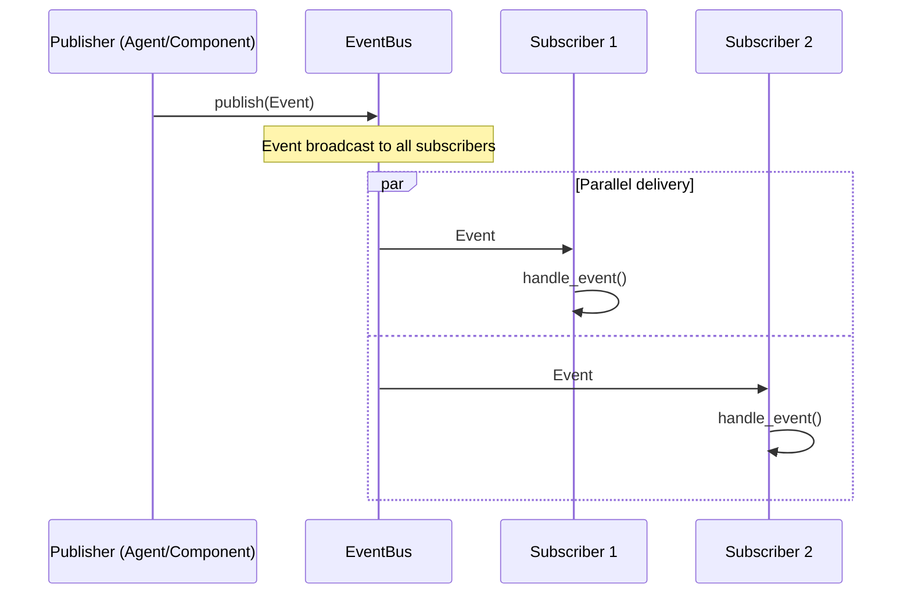
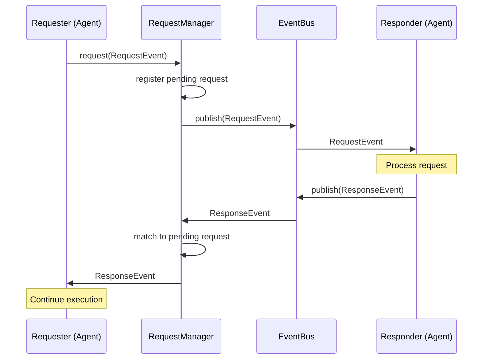
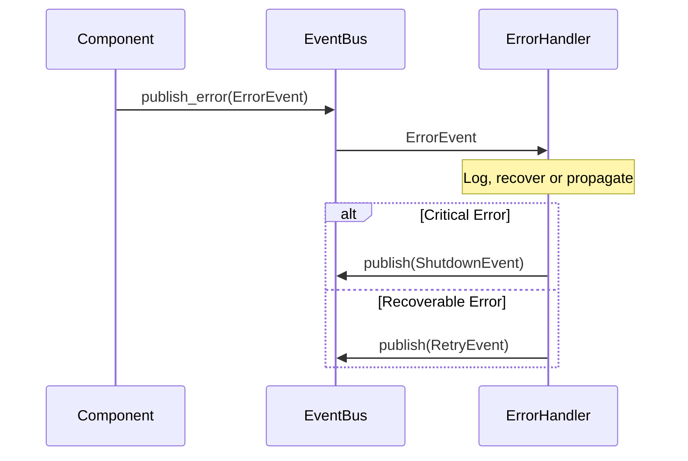

# KAIREI Quick Reference Guide

This guide provides a quick overview of the KAIREI AI Agent Orchestration Platform, designed to help developers rapidly understand the system's key components, architecture, and usage patterns.

## Documentation Strategy

KAIREI follows a layered documentation approach to minimize cognitive load while providing comprehensive information:

1. **Quick Reference Docs** (You are here)
   - Essential concepts, patterns, and relationships
   - High-level overview for rapid onboarding
   - Usage examples and common development tasks
   - Entry point for new developers

2. **Architecture in lib.rs**
   - High-level system architecture documentation
   - Cross-module relationships and pipeline flows
   - Core design principles and architectural patterns
   - Available through `cargo doc` or source code

3. **Detailed Implementation in mod.rs files**
   - Implementation details in module-level RustDocs
   - Focused on "how" rather than "why"
   - Specific to each module's functionality
   - Technical documentation for active development

This layered approach allows developers to start with quick concepts, understand the architecture, and then dive into implementation details as needed.

## What is KAIREI?

KAIREI is an AI Agent Orchestration Platform leveraging LLMs. It provides a flexible and scalable development and execution environment for AI agents using an intuitive DSL (Domain Specific Language) and event-driven architecture.

## System Architecture

```
┌───────────────────────────────────────────┐
│      Client Apps (CLI, Web, SDK-based)    │
└───────────┬───────────────────┬───────────┘
            │                   │
┌───────────▼────────┐  ┌───────▼───────────┐
│   Direct Access    │  │     HTTP API      │
│   (kairei-core)    │  │    (kairei-http)  │
└───────────┬────────┘  └───────┬───────────┘
            │                   │
            └────────┬──────────┘
                     │
┌────────────────────▼────────────────────────┐
│                 kairei-core                 │
│  ┌──────────────────────────────────────┐   │
│  │             System Layer             │   │
│  └──────────────────────────────────────┘   │
│                                             │
│  ┌────────────┐  ┌───────────┐  ┌────────┐  │
│  │  Agent/    │  │  Event    │  │ Plugin │  │
│  │  Type      │  │  System   │  │ System │  │
│  │ Registries │  │           │  │        │  │
│  └────────────┘  └───────────┘  └────────┘  │
└─────────────────────────────────────────────┘
```

## Key Components

- **System Layer**: Primary API for controlling KAIREI
- **Access Methods**:
  - Direct (kairei-core): High performance for edge devices
  - HTTP API (kairei-http): Remote access and LLM integration
- **Extension Points**:
  - Provider Interface: LLM, vector stores, search services
  - Plugin Interface: Event filters, state providers, custom handlers
- **Crates Structure**:
  - `kairei-core`: Core functionality (primary dependency)
  - `kairei-http`: HTTP API interface
  - `kairei-cli`: Command-line tool
  - `kairei-web`: Web UI
  - `kairei-sdk`: Client SDK (supports both access methods)

## Main Design Decisions

1. **Monolithic Core**: Avoids excessive trait fragmentation while maintaining clear extension points
2. **Unified System Interface**: Single point of control across deployment methods
3. **Event-Driven Communication**: Enables loose coupling and async processing
4. **LLM Integration**: Function calling API and agent creation assistance

## HTTP API Structure
```
/systems
  POST /start              # Start the system
  POST /stop               # Stop the system
  ...

/systems/:id/agents
  GET    /                 # List all agents
  GET    /{id}             # Get agent information
  ...

/systems/:id/events(planning)
  POST   /emit             # Publish an event
  GET    /subscribe        # Stream events (WebSocket)
  ...
```

## KAIREI-Core Structure

KAIREI follows a layered architecture with clear separation of concerns:

```
┌─────────────────────────────────────────────┐
│                 User Layer                  │
│  (DSL Code, CLI Interface, Applications)    │
└───────────────────┬─────────────────────────┘
                    │
┌───────────────────▼─────────────────────────┐
│               Processing Pipeline           │
│  ┌─────────┐  ┌───────────┐  ┌───────────┐  │
│  │ Lexical │  │ Syntactic │  │ Semantic  │  │
│  │ Analysis│→ │ Analysis  │→ │ Analysis  │  │
│  │(Tokenizer) │ (Parser)  │  │(TypeCheck)│  │
│  └─────────┘  └───────────┘  └───────────┘  │
└───────────────────┬─────────────────────────┘
                    │
┌───────────────────▼─────────────────────────┐
│              Runtime Environment            │
│ ┌─────────────┐  ┌─────────────┐            │
│ │Event System │  │    AST      │            │
│ │   Bus       │←→│  Evaluator  │            │
│ └─────────────┘  └─────────────┘            │
└───────────────────┬─────────────────────────┘
                    │
┌───────────────────▼─────────────────────────┐
│              Provider Layer                 │
│  (LLM Integration, Plugins, Extensions)     │
└─────────────────────────────────────────────┘

## Key Modules Quick Reference

| Module | Purpose | Key Components |
|--------|---------|----------------|
| `tokenizer` | Lexical analysis | `Tokenizer`, `Token`, various token types |
| `preprocessor` | Token normalization | `TokenPreprocessor`, `StringPreprocessor` |
| `analyzer` | Syntactic analysis | `Parser` trait, combinators, specialized parsers |
| `ast` | Abstract Syntax Tree | Agent/world definitions, statements, expressions |
| `type_checker` | Semantic analysis | Type validation, scope management, interfaces |
| `eval` | Runtime execution | Statement/expression evaluation, context management |
| `event` | Event distribution | `EventBus`, event registration, event handling |
| `provider` | LLM integration | Service providers, plugins, capability interfaces |
| `runtime` | Agent orchestration | Agent lifecycle, state management, coordination |

## DSL Quick Reference

KAIREI DSL has two main components:

### 1. World Definition

```kairei
world ExampleWorld {
    config {
        tick_interval: Duration = "1s"
    }

    events {
        CustomEvent(param: String)
    }

    handlers {
        on CustomEvent(param: String) {
            // Handle event
        }
    }
}
```

### 2. Agent Definition

```kairei
micro ExampleAgent {
    policy "Provide helpful responses with accurate information"

    state {
        counter: i64 = 0;
    }

    lifecycle {
        on_init {
            // Initialization code
        }
    }

    observe {
        on CustomEvent(param: String) {
            self.counter += 1;
        }
    }

    answer {
        on request GetCount() -> Result<i64, Error> {
            return Ok(self.counter);
        }
    }

    react {
        // Reactive behaviors
    }
}
```

## Common Development Tasks

### Building the Project

```bash
cargo build
```

### Running Tests

```bash
cargo test
```

### Running KAIREI

```bash
RUST_LOG=kairei=debug cargo run --bin kairei
```

### Format & Lint

```bash
cargo fmt && cargo clippy -- -D warnings
```

## Error Handling Patterns

KAIREI uses result-based error handling with specialized error types for different stages:

- `ASTError` - Parsing and AST creation errors
- `TypeError` - Type checking errors
- `EvalError` - Runtime evaluation errors

## Type System

KAIREI implements a static type system with support for:

- Basic types: `String`, `i64`, `f64`, `Boolean`, etc.
- Complex types: `List<T>`, `Map<K,V>`, `Result<T,E>`
- Custom types: User-defined structured types
- Plugin types: Extension-provided types

## Event-Driven Architecture

The system uses an event-driven architecture with:

- Event emission and subscription
- Event-based communication between agents
- Asynchronous event processing

### Event Publishing Flow



### Request-Response Pattern



### Event Error Handling



## Provider Configuration Validation

KAIREI uses a comprehensive validation system for provider configurations:

### Provider Types and Requirements

#### Memory Provider

**Required Fields**:
- `type`: Must be "memory"

**Optional Fields**:
- `ttl`: Time-to-live in seconds (number, must be > 0)

**Capabilities**:
- Requires `memory` capability

**Example**:
```json
{
  "type": "memory",
  "ttl": 3600,
  "capabilities": {
    "memory": true
  }
}
```

#### RAG Provider

**Required Fields**:
- `type`: Must be "rag"
- `chunk_size`: Size of text chunks (number, must be > 0)
- `max_tokens`: Maximum tokens to process (number, must be > 0)

**Optional Fields**:
- `similarity_threshold`: Threshold for similarity matching (number, between 0.0 and 1.0)

**Capabilities**:
- Requires `rag` capability

#### Search Provider

**Required Fields**:
- `type`: Must be "search"
- `max_results`: Maximum number of search results (number, must be > 0)

**Capabilities**:
- Requires `search` capability

### Validation Process

KAIREI uses a two-phase validation approach:

1. **Compile-Time Validation** (`TypeCheckerValidator`):
   - Schema structure and types
   - Required fields
   - Deprecated fields (warnings)

2. **Runtime Validation** (`EvaluatorValidator`):
   - Provider-specific constraints
   - Capability requirements
   - Dependencies
   - Suboptimal configurations (warnings)

### Common Validation Errors and Fixes

| Error | Example | Fix |
|-------|---------|-----|
| Missing Required Field | `{ "ttl": 3600 }` (Missing "type") | Add the missing field: `"type": "memory"` |
| Invalid Type | `{ "type": "memory", "ttl": "3600" }` (String instead of number) | Change to number: `"ttl": 3600` |
| Invalid Value | `{ "type": "memory", "ttl": 0 }` (Must be > 0) | Use positive value: `"ttl": 3600` |
| Missing Capability | `{ "type": "memory", "capabilities": {} }` (Missing capability) | Add capability: `"memory": true` |

### Validation Best Practices

1. **Use Both Validators**: Always use both `TypeCheckerValidator` and `EvaluatorValidator`
2. **Collect All Errors**: Use `validate_collecting` to get all validation errors at once
3. **Pay Attention to Warnings**: Address warnings to improve performance and quality
4. **Use Templates**: Start with example configurations as templates
5. **Validate Incrementally**: Validate after each significant change

For detailed information, see the [Provider Configuration Validation Reference](../reference/provider_config_validation.md).

## Further Resources

- [KAIREI Documentation](../README.md)
- [Design Documentation](../design/architecture.md)
- [API Documentation](https://your-documentation-link.com) (generated with `cargo doc`)
